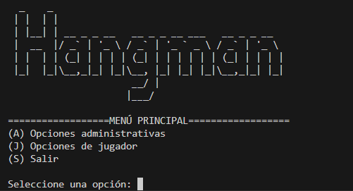

# Ahorcado ConsolApp

## Descripción
Juego de Ahorcado para terminal desarrollado en Python. Permite administrar palabras y frases, jugar por niveles y consultar historial o estadísticas mediante archivos de texto.

## Objetivo
Practicar programación estructurada, validación de entradas, persistencia local y construccion de una experiencia de consola clara.

## Tecnologías utilizadas
- Python 3
- Interfaz de consola
- Archivos .txt
- Códigos ANSI

## Funcionalidades principales
- Juego en modo principiante y avanzado
- Módulo administrativo protegido por archivo de acceso
- Gestión de palabras, frases, ayuda, historial y estadísticas
- Módulos separados para juego, administración, autenticación y utilidades

## Mi rol
Desarrollé la lógica principal, el flujo de menus, la persistencia en archivos y la organización modular.

## Aprendizajes clave
- Modelado de reglas de juego
- Lectura y escritura de archivos
- Validación de opciones y estados
- Organización de proyectos Python

## Instalación y ejecución
```bash
cd Ahorcado-ConsolApp
python main.py
```

## Estructura del proyecto
- main.py: punto de entrada
- src/: módulos principales
- data/: archivos de datos
- screenshots/: captura principal

## Capturas o demo


## Estado del proyecto
Proyecto académico funcional.

## Valor técnico demostrado
Demuestra dominio de Python, modularización, persistencia local y flujos interactivos en terminal.

## Mejoras futuras
- Agregar pruebas automatizadas
- Migrar datos a JSON o SQLite
- Mejorar manejo de archivos faltantes

## Autor
Geovanni González  
Estudiante de Ingeniería en Computación  
GitHub: [Geovanni-Gonzalez](https://github.com/Geovanni-Gonzalez)


